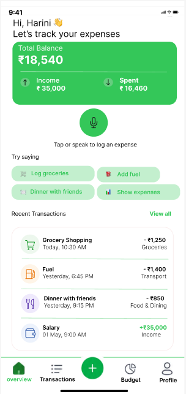
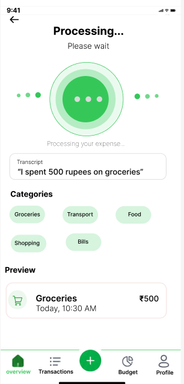
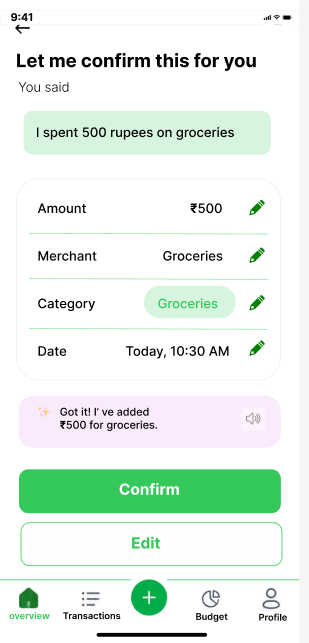
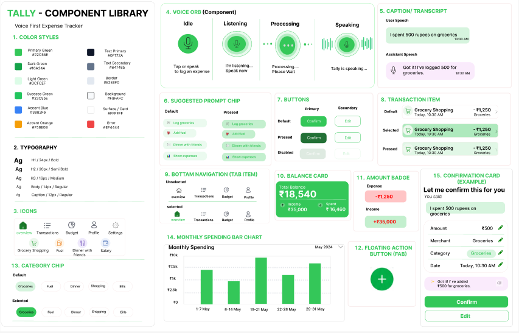
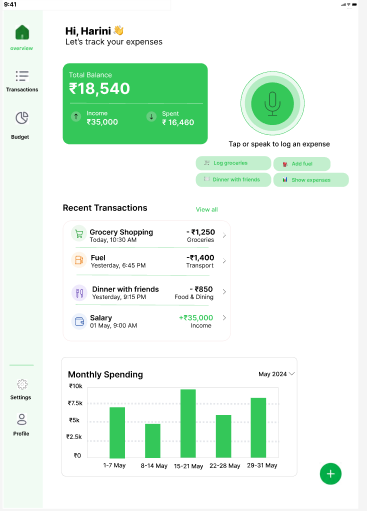

# Tally - Voice-First Expense Tracker

A mobile-first UI/UX design project for a voice-first expense tracking application created as part of a UI/UX Designer skills assessment.

## Project Overview

Tally allows users to record expenses primarily through voice while providing clear visual feedback and touch-based alternatives.

The design focuses on making the application's state clear at every moment, including listening, processing, and confirmation.

## Task

Task B - Tally, a Voice-First Expense Tracker

## Screens Designed

### 1. Overview
- Greeting header
- Balance summary card
- Voice orb as the primary expense logging control
- Suggested voice prompts
- Recent transactions
- Bottom navigation

### 2. Voice Capture
- Listening state
- Voice waveform
- Live transcript
- Expense categories
- Expense preview
- Voice interaction feedback
- Bottom navigation

### 3. Processing
- Processing state
- Processing animation
- Transcript
- Expense categories
- Expense preview
- Bottom navigation

### 4. Confirmation
- Spoken input
- Parsed expense details
- Amount
- Merchant
- Category
- Date
- Confirm and Edit actions
- Bottom navigation

## Figma Techniques

- Components and variants
- Auto Layout
- Reusable UI components
- Styles
- Constraints
- Responsive design
- Prototype interactions
- Smart Animate

## Prototype Flow

Overview → Voice Capture → Processing → Confirmation

The prototype demonstrates the voice interaction flow and transitions between different voice states.

## Tool

Figma

## Designer

Tarlana Harini

## Portfolio

https://tarlanaharini.github.io/portfolio/

## Figma Design

https://www.figma.com/design/Sp8sPu8VFapxfEoZBwJar0/TARLANA-HARINI-Task-B---Voice-First-Expense-Tracker?node-id=0-1&t=XfYk5soMHIkf1Dxl-1

## Screenshots

### Overview

### Voice Capture

### Processing

### Confirmation

### Components

### Responsive Tablet Design

